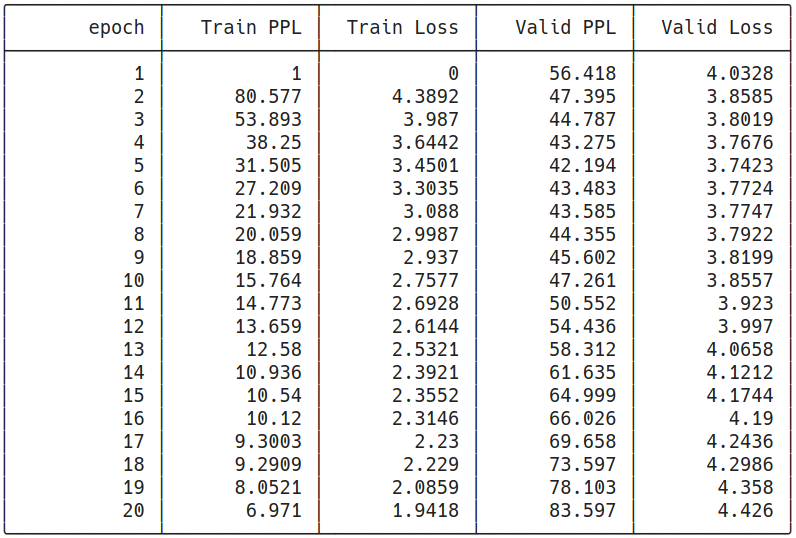
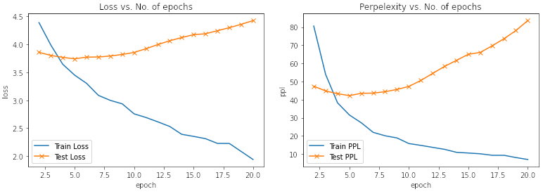
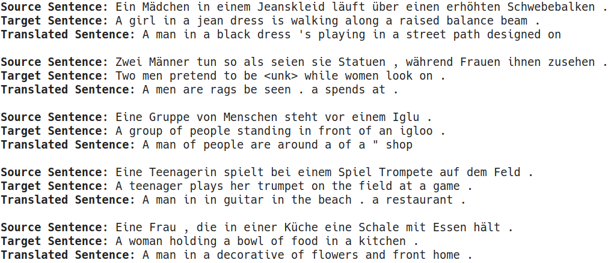
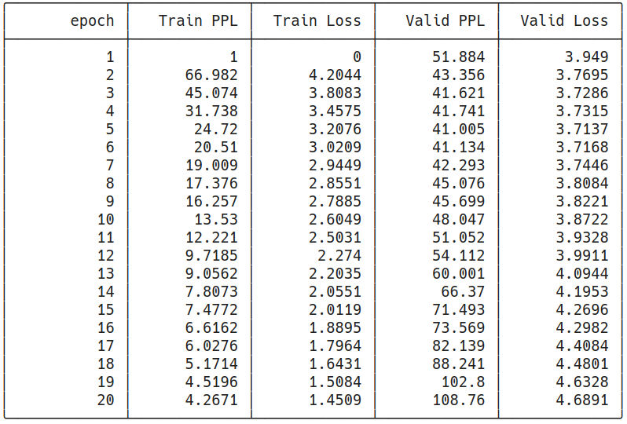
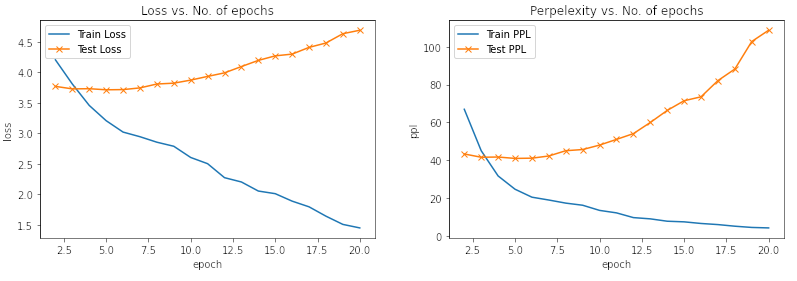
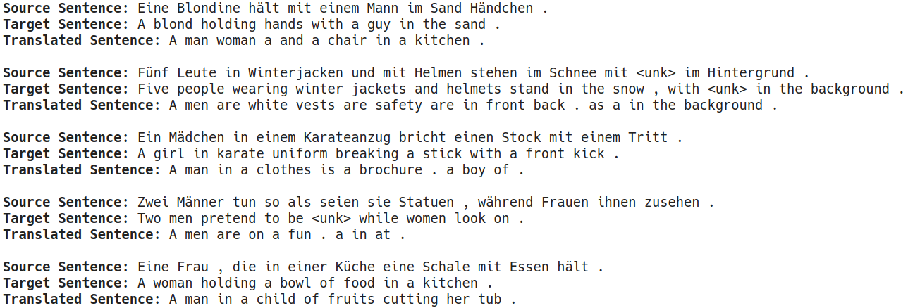
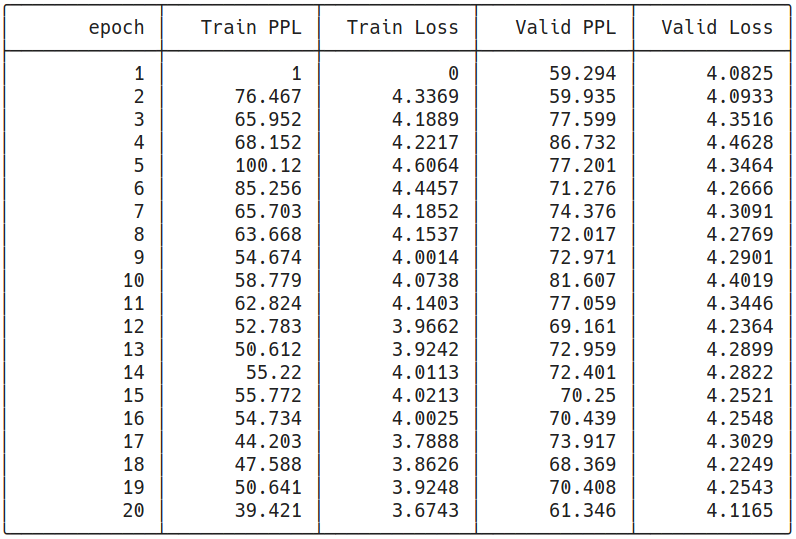
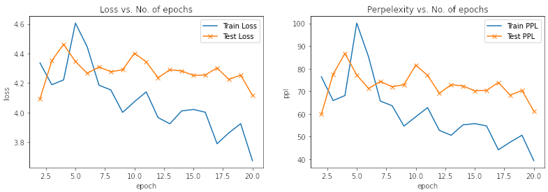
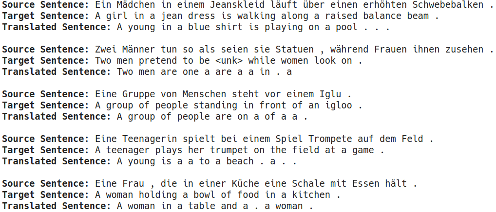

# E2A12

**Note: only code changes/major additional codes are shown. For complete code, please see the accompanying notebooks**

## Objectives
The objectives of this assignment was to implement Transformers from scracth and demonstrate its use on a dataset of one's choice.

For this week, the German-to-English translation task from the Multi30k dataset was chosen

Highlight:
- Model was written in PyTorch Lightning
- Attention scores were calculated using both Einsum notation as well as matrix multiplication. The former is concise; the latter gives a better description of whats going on under the hood
  - Slight changes had to be made to the mask preparation functions.
  - Both yield similar results
- The `src_pad_idx` and `trg_pad_idx` were both set to 1 to be consistent with our previous code where `PAD_IDX=1`
- This model required the batches to be in the format `(batch, seq_length)` unlike the previous code where it was `(seq_length, batch)`; to fix this, the `batch_first=True` argument was passed to the `pad_sequence` function in the collator
- For comparison, I also used the built-in `nn.Transformer` module in the PyTorch library. Scroll down to see the results!


## Transformers - BMM Implementation

[](https://colab.research.google.com/github/mmgxa/E2A12/blob/main/END2_Assign12_bmm.ipynb)

Here, we used the matrix multiplications in the self-attention module. It performed nearly on par as compared with the EInsum implementation, proving that the implementation is correct!

### Mask Preparation Functions

```python
def make_src_mask(self, src):
  src_mask = (src != self.src_pad_idx).unsqueeze(1)
  return src_mask.to(self.device)

def make_trg_mask(self, trg):
  N, trg_len = trg.shape
  trg_mask = torch.tril(torch.ones((trg_len, trg_len))).expand(N, trg_len, trg_len) 
  return trg_mask.to(self.device)
```
### Training Log


### Plot of Loss/Perplexity vs. Epoch


### Sample Predictions


## Transformers - Einsum Implementation

[](https://colab.research.google.com/github/mmgxa/E2A12/blob/main/END2_Assign12_einsum.ipynb)

The same code as shown in the class was implemented.

### Training Log


### Plot of Loss/Perplexity vs. Epoch


### Sample Predictions


## Transformers - PyTorch Implementation

[](https://colab.research.google.com/github/mmgxa/E2A12/blob/main/END2_Assign12_pytorch.ipynb)

PyTorch library has a built-in `nn.Transformer` Module.  It had lower number of parameters, and ran much faster (optimized code by PyTorch???). However, it performed worse than our implementations. Moreover, I was unable to train it for number of layers > 3, as the loss would just oscillate.

### Training Log


### Plot of Loss/Perplexity vs. Epoch


### Sample Predictions


# Comparison of Results


| Model  | Train Loss (20 Epochs) | # of Parameters | 
| --------- | --------- | --------- | 
| BMM  | 1.9418  |  51.2 M  | 
| Einsum  | 1.4509  | 51.2 M | 
| nn.Transformer  | 3.6743  | 30.6 M |
